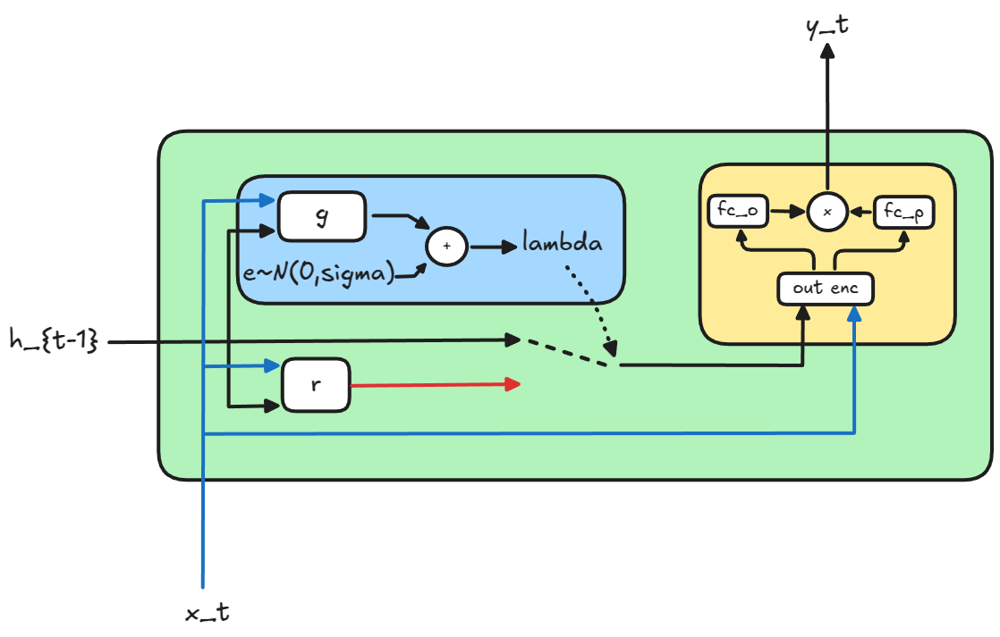
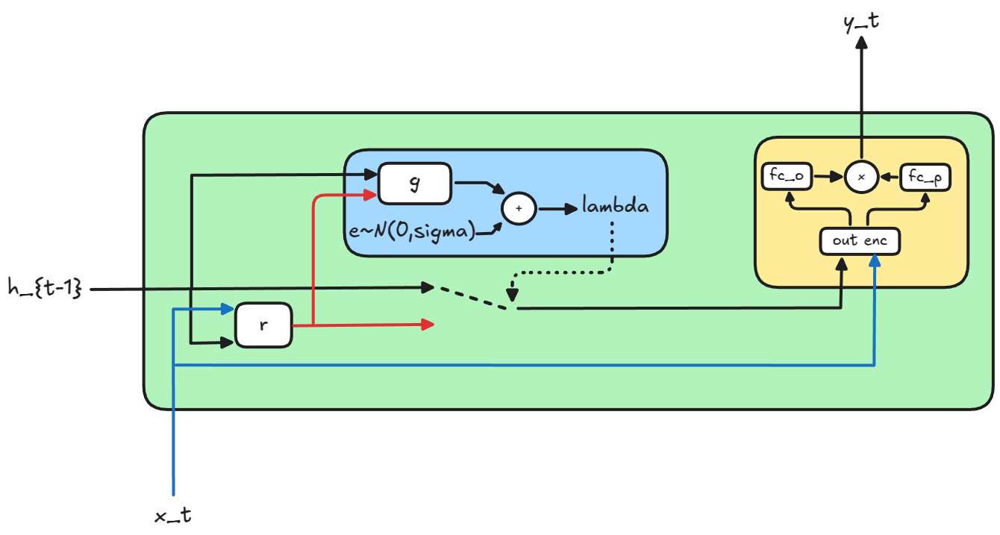
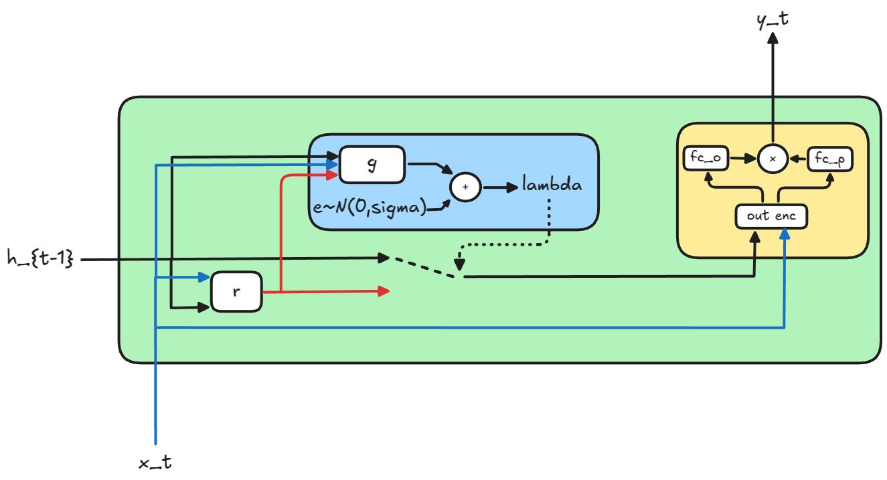
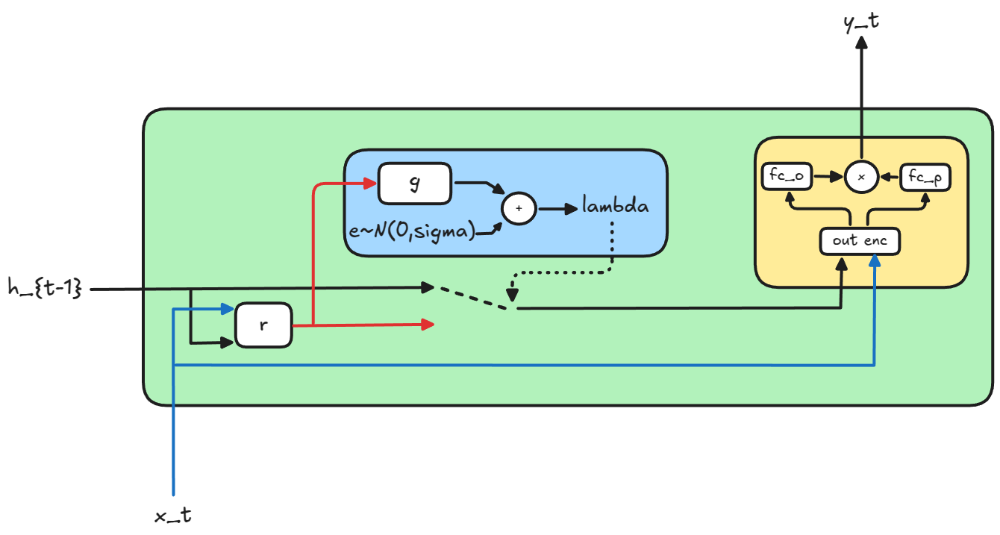

# GateL0RD Deep Learning Pipeline

A comprehensive PyTorch Lightning-based pipeline for training, evaluating, and comparing GateL0RD models with parameter scaling experiments.

## Overview

This pipeline implements the GateL0RD architecture from ["Sparsely Changing Latent States for Prediction and Planning in Partially Observable Domains"](https://arxiv.org/abs/2110.15949) with focus on:

- **Parameter Scaling**: Experimenting with reduced parameters while maintaining performance
- **Version Comparison**: Comparing v0-v3 architectures with different gate/recurrent network inputs
- **HPO Integration**: Hyperparameter optimization using Optuna for g and r network scaling
- **Time Series Datasets**: Support for continuous data streams with discrete events

## Architecture Versions

| Version | Gate Network Input | Recurrent Network Input | Focus |
|---------|-------------------|-------------------------|--------|
| v0 | `[input, hidden]` | `[input, hidden]` | Baseline (full inputs) |
| v1 | `[hidden, hidden]` | `[input, hidden]` | Reduced gate inputs |
| v2 | `[input, hidden, hidden]` | `[input, hidden]` | Expanded gate inputs |
| v3 | `[hidden]` | `[input, hidden]` | Minimal gate inputs |

## Original Implementation

This is a lightweight PyTorch implementation of GateL0RD and variants to its cell architecture. We provide two variants of GateL0RD: `GateL0RD` can be used like a regular PyTorch `RNN`, whereas `GateL0RDCell` can be used like a PyTorch `RNNCell`.

## Installation

### Dependencies

```bash
# Core dependencies
pip install torch torchvision pytorch-lightning
pip install optuna
pip install numpy pandas matplotlib seaborn
pip install scikit-learn
pip install pyyaml

# Optional: For physics simulation datasets
pip install pybullet
pip install gym[all]
```


## V0 - [Code](gatel0rd/v0.py)
The original implementation as it was introduced by the paper


## V1 - [Code](gatel0rd/v1.py)
Motivation behin this approach is to save computation resources in the `g` as the only job of `g` is to decide it the the new candidate hidden state, proposed by `r` is worth updating. In parallel this should improve robustness because `g` is aware of what `r` is proposing and can make its prediction for `lambda` based on the behavior of `r` which removes the assumption `r` and `g` have to extract the same features at the same time from `h_{t-1}` and `x_t`.  



## V2 - [Code](gatel0rd/v2.py)
This is a union of version v0 and v1 as we also provide information about the ground truth state and the candidate hidden state to `g`. 


## V3 - [Code](gatel0rd/v3.py)

The motivation behind v3 is to slim down information to `g` as much as possible. With v3 you can observe if information about the last hidden state can be inferred from the candidate state. This version should be used in ablation studies.

            

## Other changes

Please note that we altered the architecture of the output network a bit with a common feature extractor from the new hidden state and current input. After feature extraction we pass the emedding `fc_p` and `fc_o`. `fc_p` has the job of deciding which features, proposed by `fc_o`, are important and which are not.

## Criterion 

Because we introduce a new crucial coefficient lambda and want to learn sparse hidden state changes we additionally regularize lambda to the task loss. In this repo we provide a [wrapper criterion](gatel0rd/criterion.py) which takes the task criterion while initializing and in the forward additionally information about if the gate was opened or not (`theta_t`).